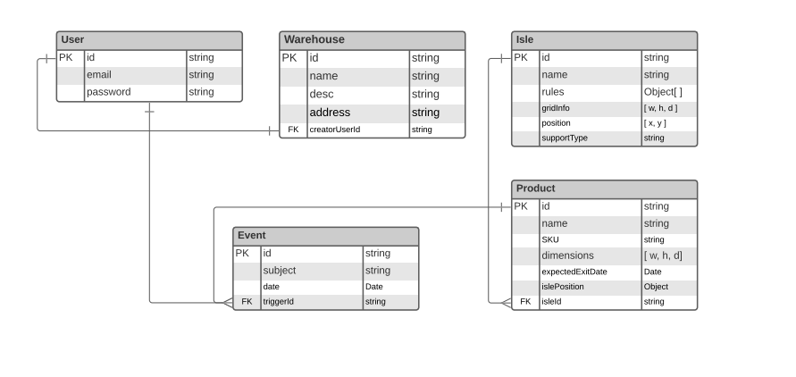

# Entità e DB



Le entità principali sono cinque, e corrispondono alle collezioni presenti nel database Mongo.

La libreria Mongoose \([https://mongoosejs.com/](https://mongoosejs.com/)\) ci consente di strutturare degli _schema_ che andranno a generare dei _model_ gestendo automaticamente connessioni e collezioni.

Di seguito i punti chiave delle operazioni con il DB


```typescript
@Module({
  imports: [
    MongooseModule.forRoot(
      'mongodb+srv://stringadiconnessione',
      { ...config.db.mongo.defaultRootOptions }),
    UsersModule,
    AuthModule,
    WarehousesModule
  ],
  controllers: [...],
  providers: [AppService]
})
export class AppModule {
}
```



```typescript
export type WarehouseDocument = Warehouse & Document;

@Schema()
export class Warehouse implements WarehouseEntity {
  @Prop()
  address: string;

  @Prop()
  desc: string;

  @Prop()
  name: string;

  @Prop({ type: MongooseSchema.Types.ObjectId, ref: User.name })
  creatorUserId: string;
}

export const WarehouseSchema = SchemaFactory.createForClass(Warehouse);
```


